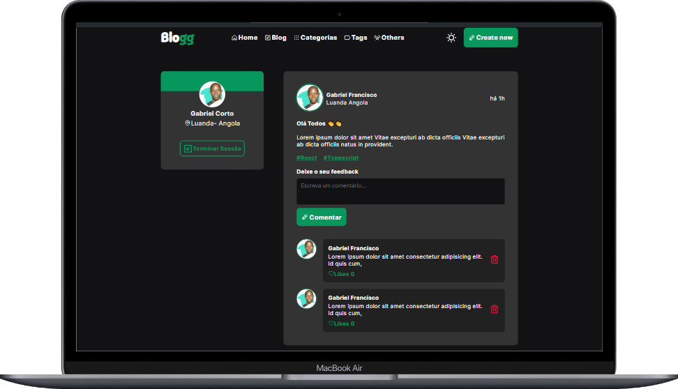
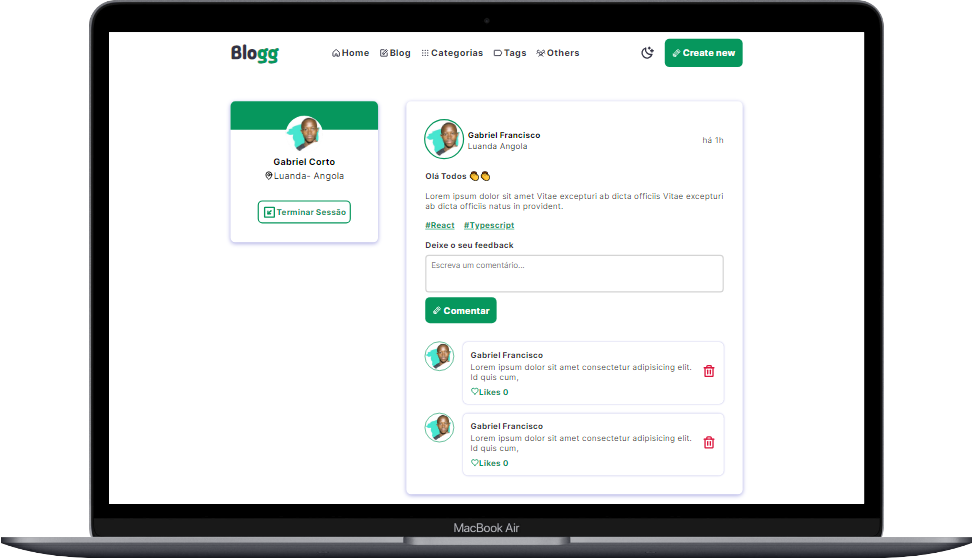
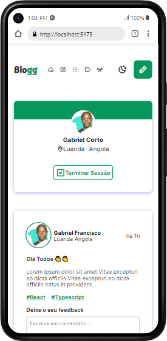
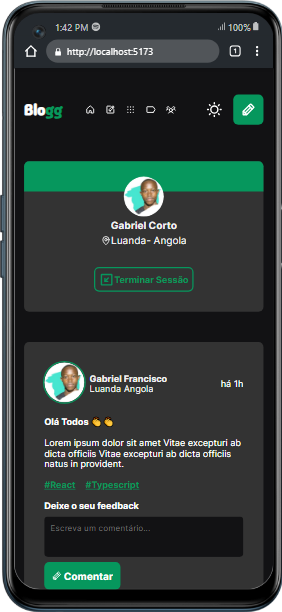

# Blogg 

Project Layout, Developing React Aplication using TypesScript to pratice some topics with react like Context API, States, Components, LocalStorage, Pure CSS and I Would like to add moe features Because I Want Learn Next.JS ans Node.JS. 

  
  

  <h1>Mobile Version</h1>

  
  

